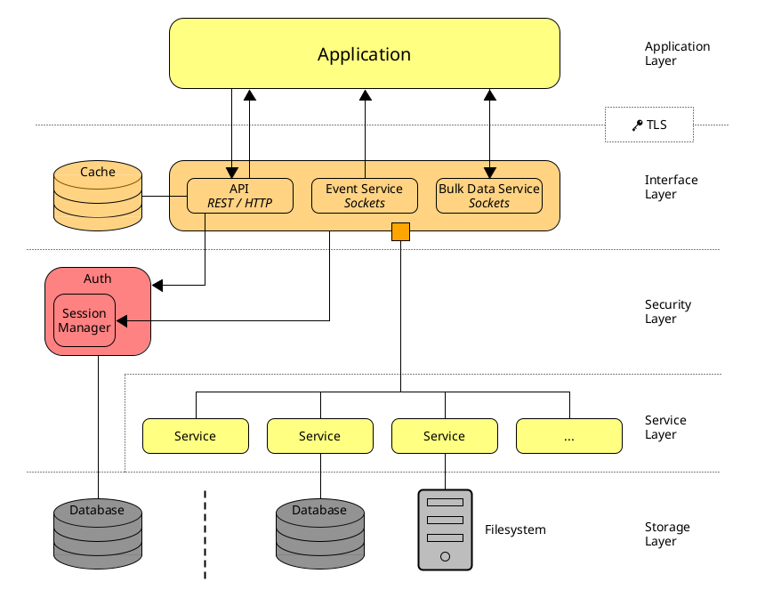

# Burrow Studios API documentation
This repository documents the Burrow Studios API Gateway.

## Architecture
This documentation only describes the interface layer and its endpoints.
Our current plan for the architecture of our entire system looks something like this:

This will keep changing until a first release of the API Gateway exists.